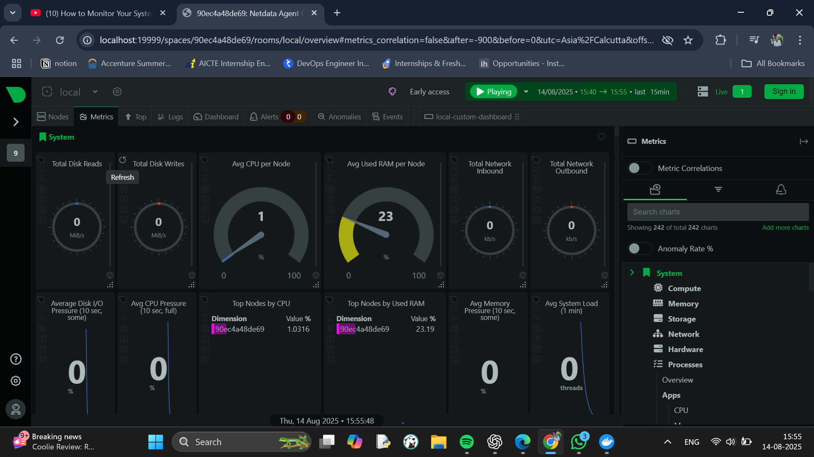

# Task 7: Monitor System Resources Using Netdata

## Objective
Install Netdata and visualize system and application performance metrics using Docker.

## Tools Used
- **Netdata** (Free, open-source monitoring tool)
- **Docker**

## Steps Performed

1. Run Netdata in Docker
   ```powershell
   docker run -d --name=netdata -p 19999:19999 --cap-add=SYS_PTRACE --security-opt apparmor=unconfined netdata/netdata

2. **Access the Dashboard**

Open a browser and go to: http://localhost:19999

3. **Metrics Observed**

CPU usage

RAM usage

Disk read/write speed

Network inbound/outbound traffic

System load

4. **Explore Alerts & Logs**

Alerts: From the Health tab in the dashboard.

Logs:

docker exec -it netdata /bin/bash
cat /var/log/netdata/error.log

Screenshot



Conclusion

Netdata provides an easy-to-use, web-based interface for real-time system monitoring. Running it in Docker makes it portable and quick to set up.