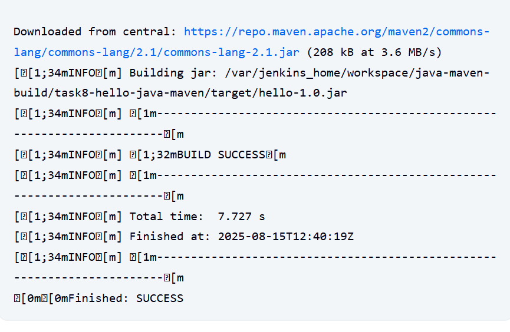

# Task 8 - Java Maven Build with Jenkins

## 📌 Objective
Create a basic Java HelloWorld application, configure a Jenkins Freestyle job to build it using Maven, and verify the successful build.

---

## 📂 Project Structure
task8-hello-java-maven/
├── pom.xml
└── src/
└── main/
└── java/
└── HelloWorld.java


## ⚙️ Steps Performed
1. **Created Java HelloWorld application** with `pom.xml` for Maven build configuration.
2. **Pushed project to GitHub repository**.
3. Installed **Maven** inside Jenkins container:
   ```bash
   docker exec -u 0 -it <jenkins_container_id> bash
   apt update && apt install -y maven
4. Configured Jenkins Freestyle Job:

   Source Code Management: Git (Repo URL)

   Build Tool: Maven (clean install)

5. Triggered Build and verified output.

## 
Screenshots

Jenkins console output with BUILD SUCCESS ✅